# End-to-End DevOps Pipeline for Java Web App on AWS

## Project Overview

This project demonstrates a complete end-to-end DevOps workflow for deploying, monitoring, and alerting a Java web application on AWS.

It includes source code management with GitHub, automated CI/CD using Jenkins, Maven-based WAR build, deployment to Apache Tomcat, Nginx reverse proxy configuration, Prometheus monitoring, Grafana visualization, Alertmanager alert routing, and Telegram notifications.

---

## Project Architecture

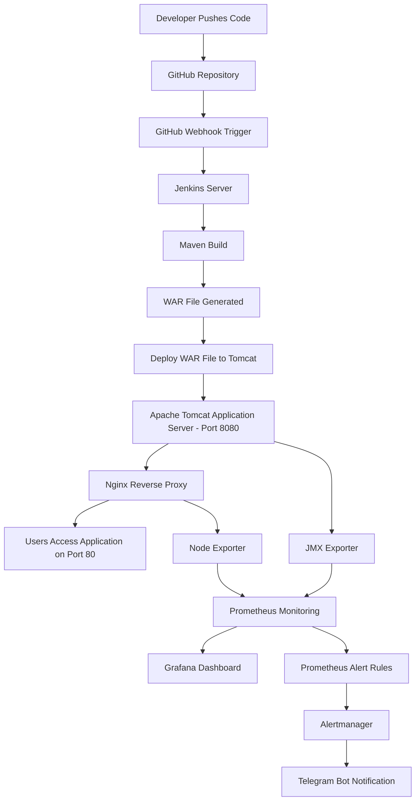

---

## Monitoring and Alerting Flow

```mermaid
flowchart TD
    A[Application Server - AWS EC2] --> B[Apache Tomcat]
    A --> C[Node Exporter]
    B --> D[JMX Exporter]

    C --> E[Prometheus]
    D --> E

    E --> F[Grafana Dashboard]
    E --> G[Prometheus Alert Rules]

    G --> H[Alertmanager]
    H --> I[Telegram Bot API]
    I --> J[Telegram Alert Notification]

    F --> K[Real-time Metrics Visualization]
```

---

## Technologies Used

- AWS EC2
- GitHub
- Jenkins
- Maven
- Apache Tomcat
- Nginx
- Prometheus
- Node Exporter
- JMX Exporter
- Grafana
- Alertmanager
- Telegram Bot API
- Linux / Ubuntu

---

## Features Implemented

- Java web application deployed on Apache Tomcat
- Automatic Jenkins build trigger using GitHub webhook
- Maven build process to generate WAR file
- Automated WAR deployment to Tomcat application server
- Nginx reverse proxy configuration for clean application access on port 80
- Prometheus monitoring for server and Tomcat metrics
- Node Exporter integration for system-level metrics
- JMX Exporter integration for Tomcat/JVM metrics
- Grafana dashboard for real-time monitoring visualization
- Prometheus alert rules for infrastructure and application health
- Alertmanager integration for alert routing
- Telegram bot integration for real-time alert notifications

---

## Server Setup

This project was implemented using AWS EC2 instances with separate responsibilities.

| Server | Purpose |
|---|---|
| Jenkins Server | Runs Jenkins pipeline and builds the Java application |
| App Server | Runs Tomcat, Nginx, Node Exporter, and JMX Exporter |
| Monitoring Server | Runs Prometheus, Grafana, and Alertmanager |

---

## CI/CD Deployment Flow

1. Developer pushes code changes to GitHub.
2. GitHub webhook automatically triggers the Jenkins pipeline.
3. Jenkins pulls the latest code from the GitHub repository.
4. Maven builds the Java application and generates a WAR file.
5. Jenkins deploys the WAR file to the Tomcat application server.
6. Tomcat runs the Java web application on port 8080.
7. Nginx forwards user traffic from port 80 to the Tomcat application.
8. Prometheus monitors server and Tomcat metrics.
9. Grafana displays metrics using monitoring dashboards.
10. Prometheus alert rules detect issues such as server down, Tomcat down, high CPU, and low memory.
11. Alertmanager receives alerts from Prometheus.
12. Telegram bot sends real-time alert notifications.

---

## Monitoring and Alerting

Prometheus was configured to monitor both infrastructure and application-level metrics.

### Metrics Monitored

- Server CPU usage
- Memory usage
- Disk usage
- Node Exporter availability
- Tomcat/JVM metrics
- Application server availability
- JMX Exporter availability

### Alerts Configured

- App server down
- Tomcat JMX exporter down
- High CPU usage
- Low available memory

When an alert is triggered, Prometheus sends the alert to Alertmanager. Alertmanager then forwards the notification to Telegram using Telegram Bot API.

---

## Project Links

- [Open Live Application](http://13.63.129.230/)
- [Open GitHub Repository](https://github.com/Jerin7559/end-to-end-devops-java-app-aws)

---

## Repository Structure

```text
end-to-end-devops-java-app-aws/
│
├── Jenkinsfile
├── pom.xml
├── README.md
├── .gitignore
│
├── src/
│   └── main/
│       └── webapp/
│
├── docs/
│   ├── architecture.md
│   ├── nginx.conf.example
│   ├── prometheus.yml.example
│   ├── alerts.yml
│   └── alertmanager.yml.example
│
└── screenshots/
    ├── github-webhook-trigger.png
    ├── jenkins-pipeline-success.png
    ├── jenkins-console-output.png
    ├── jenkins-console-output2.png
    ├── tomcat-running.png
    ├── website-output.png
    ├── nginx-reverse-proxy.png
    ├── prometheus-targets.png
    ├── prometheus-basicalerts.png
    ├── alertmanager-alert.png
    ├── telegram-alertnotification.png
    └── grafana-dashboard.png
```

---

## Screenshots

### GitHub Webhook Trigger

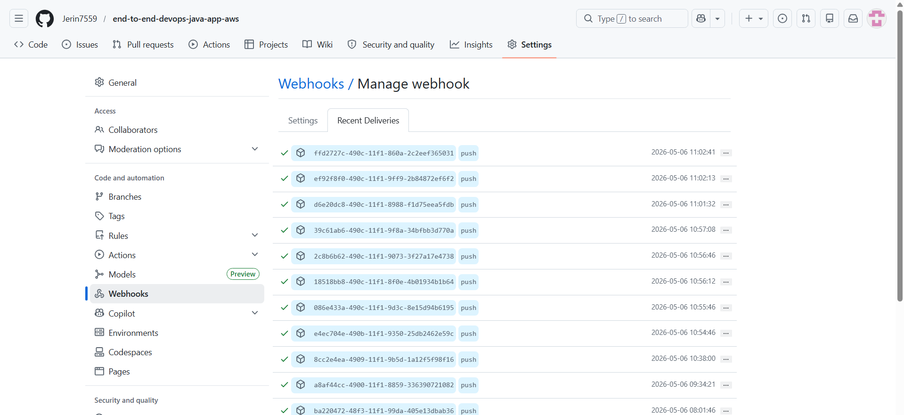

### Jenkins Pipeline Success

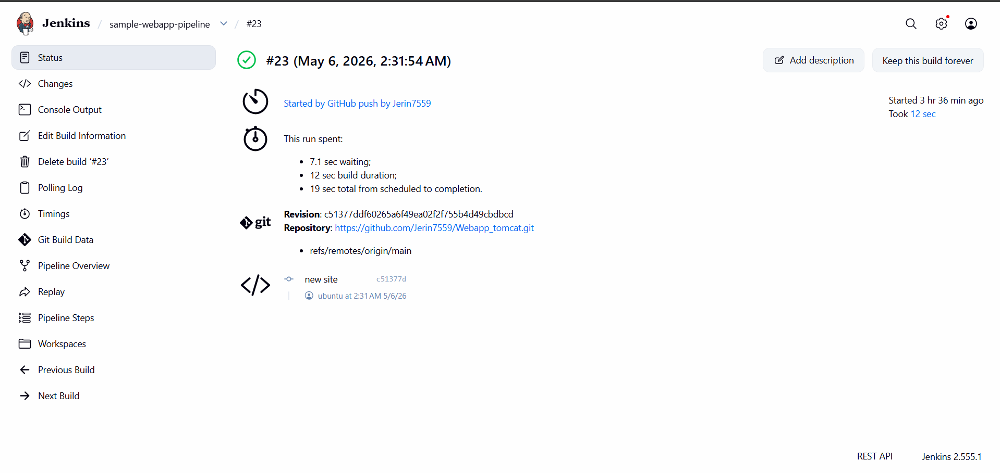

### Jenkins Console Output

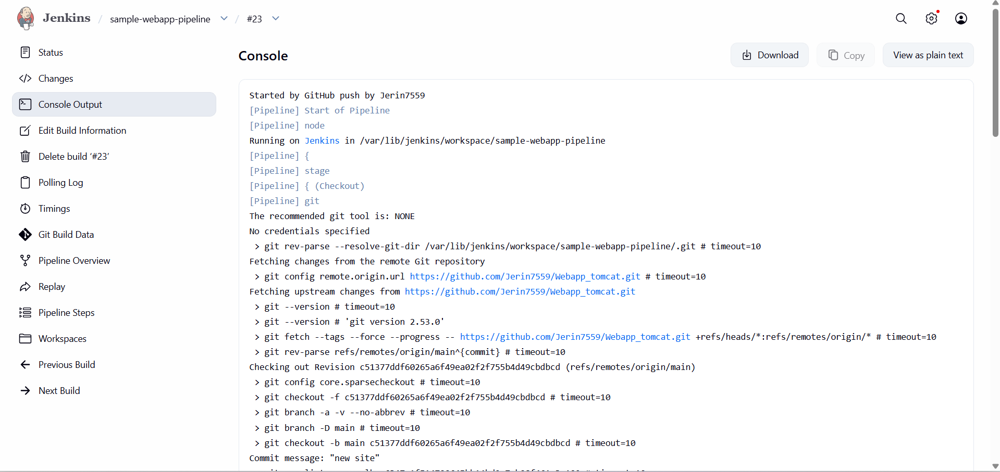

### Jenkins Console Output - Deployment Step

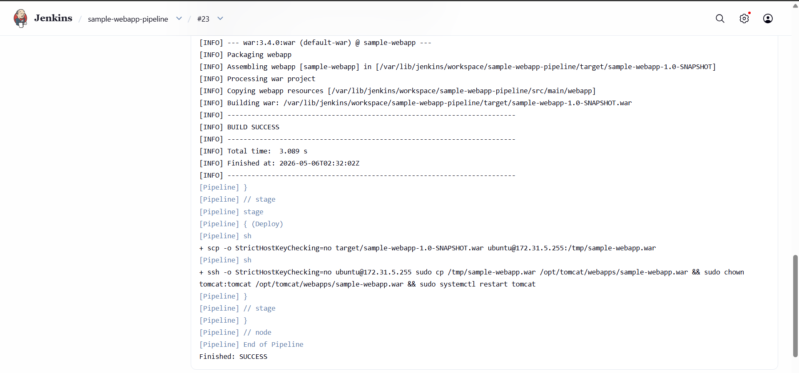

### Tomcat Running

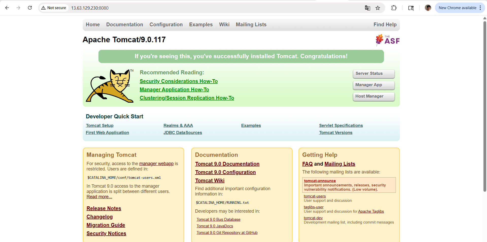

### Deployed Website Output


### Nginx Reverse Proxy Output

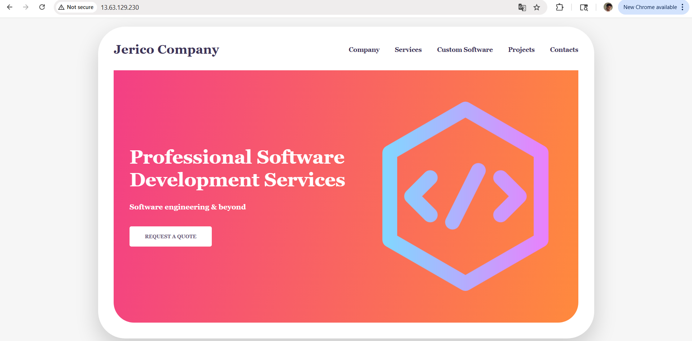

### Prometheus Targets

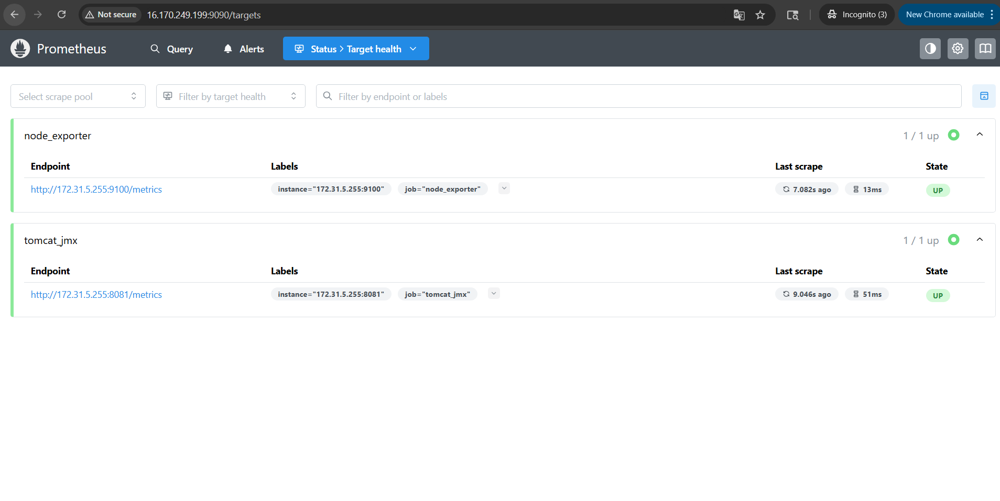

### Prometheus Basic Alerts

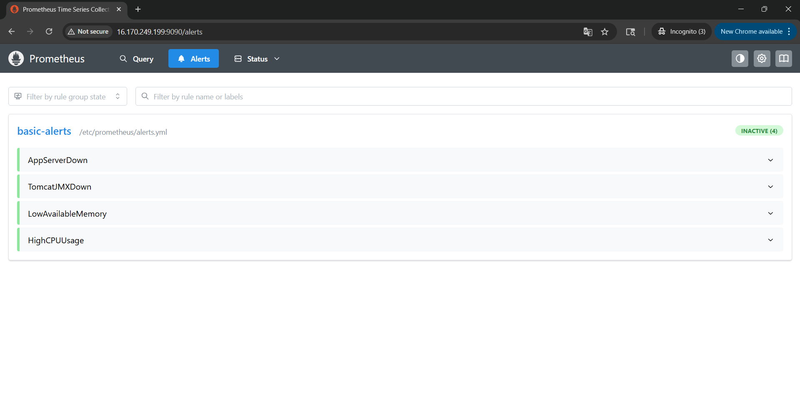

### Alertmanager Alert

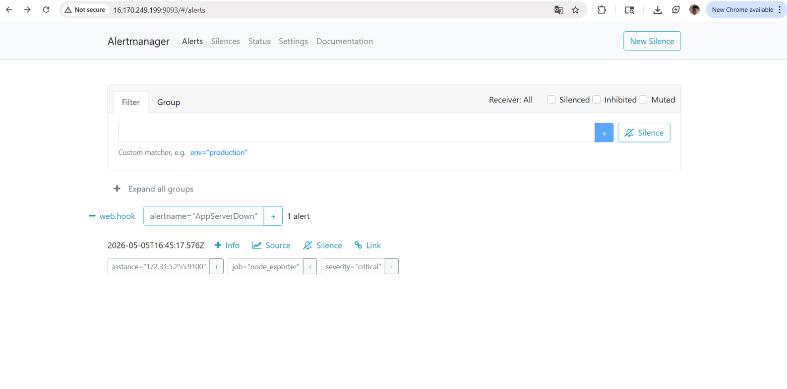

### Telegram Alert Notification

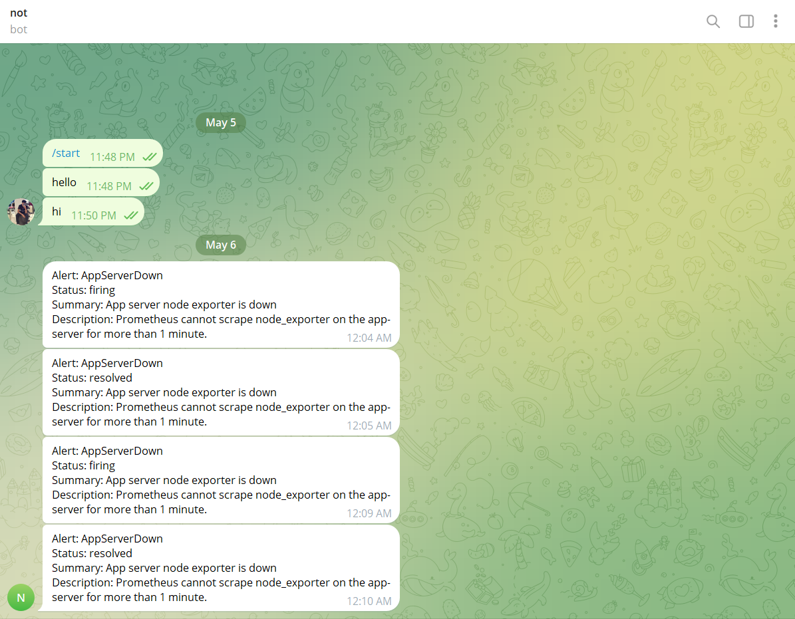

### Grafana Dashboard

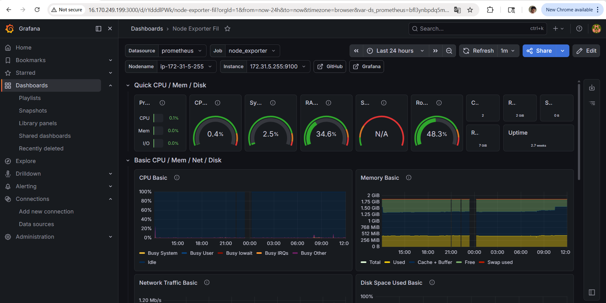

---

## Key Learning Outcomes

Through this project, I gained practical experience in:

- Building a complete CI/CD pipeline for Java application deployment
- Automating deployment using Jenkins and GitHub webhook
- Building Java applications using Maven
- Deploying WAR files to Apache Tomcat
- Configuring Nginx as a reverse proxy
- Setting up Prometheus monitoring for infrastructure and application metrics
- Creating Grafana dashboards for real-time observability
- Writing Prometheus alert rules
- Configuring Alertmanager for alert routing
- Sending real-time alert notifications to Telegram
- Understanding production-style DevOps workflow on AWS

---

## Project Status

Completed successfully.

This project represents a practical DevOps workflow covering CI/CD, deployment automation, monitoring, alerting, and notification integration.
